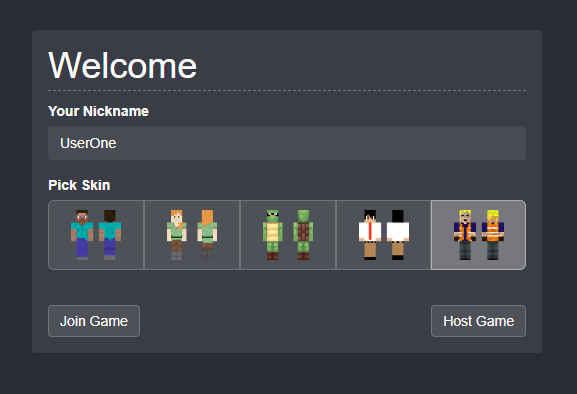
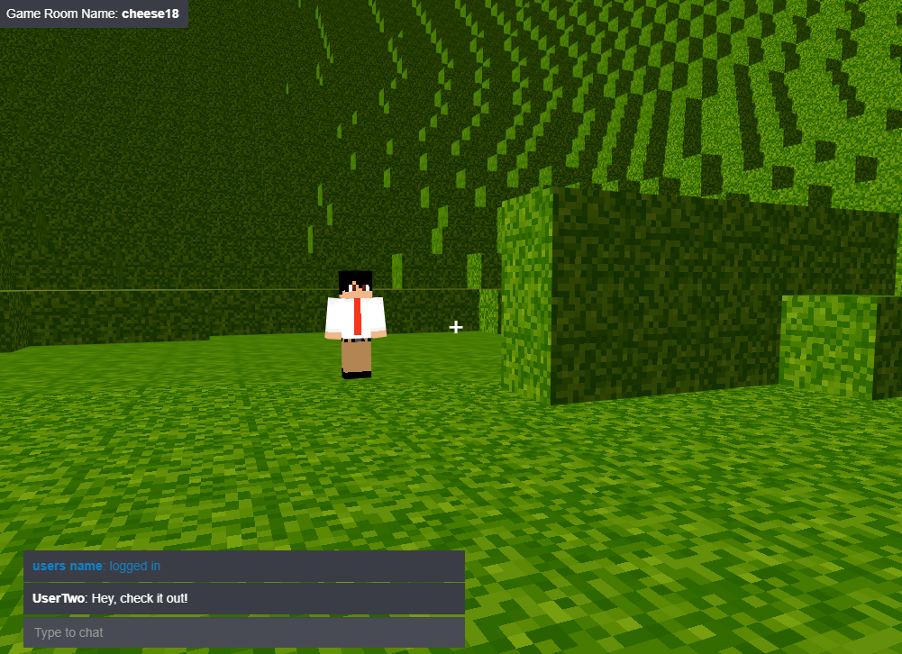

# Voxel P2P Game

Web based voxel P2P game.

#### [Check out the DEMO!](http://voxel.samkirkland.com)

### Debugging locally
###### Instructions for windows
- Download/Clone the branch
- Run `npm install`
- Run `npm start-server`
- Run `npm start`

### Project Layout
This project contains two sub-projects. A front-end react site that handles the game setup & frontend. And the game server which handles all client-to-client communication.
